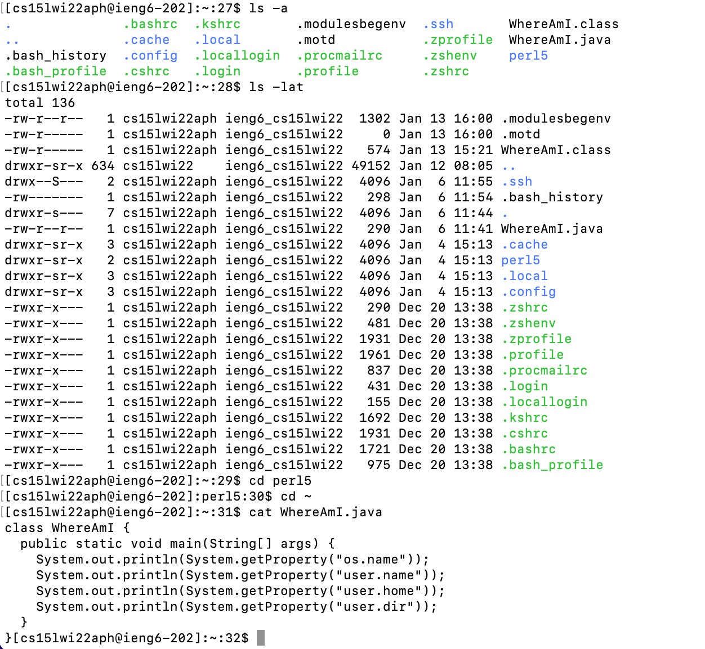

# Lab Report 1
## Installing VSCode
Although I already had VSCode installed on my computer from CSE 11, installing VSCode is relatively easy. Just find the download file [on the internet](https://code.visualstudio.com/download), and follow download instructions as prompted by your computer.

---

## Remotely Connecting
In order to connect to ieng6 remotely, just use the `ssh` command followed by your specific ieng6 account. Enter your password (spell it correctly :/). After connecting, any commands in that terminal will be run on the server, until logging out.

---

## Trying Some Commands
There are some useful bash commands that can be used in the terminal, for example:
* `ls -a` - Lists all files, including hidden ones
* `ls -lat` - Lists details for all files, including hidden ones
* `cd` - changes the current directory to the argument
* `cd ~` - changes to home directory
* `cat` prints out the contents of a file

---

## Moving Files with `scp`
To move files to a remote server use the `scp` command followed by the file name and the server name. This will override the current file on the server (if there is a file with the same name) with the bersion of the file provided.

Then, switching over to the remote server and using `ls`, the file will be there. 

---

## Setting a SHH Key
To set up an SSH key:
* first use the `ssh-keygen` command
* Enter the file location (`/Users/melina/.ssh/id_rsa`) when prompted
* Leave the passphrase blank (just press enter)
* Make a `.ssh` directory on the server (`mkdir .ssh`)
* `scp` the public key to the server from the client (`scp /Users/melina/.ssh/id_rsa.pub cs15lwi22aph@ieng6.ucsd.edu:~/.ssh/authorized_keys`)

Now you no longer will need a password to access the server from that particular client.
Logging on will look like this:

---

## Optimizing Remote Running

Because running code on the server (while editing on the client) can be tedious (it requires a lot of commands and time), I used the commands I learned during lab to make a quicker way to do this.

By running:

Then, for every subsequent edit, just press the up arrow and enter to rerun this command (no new typing necessary).