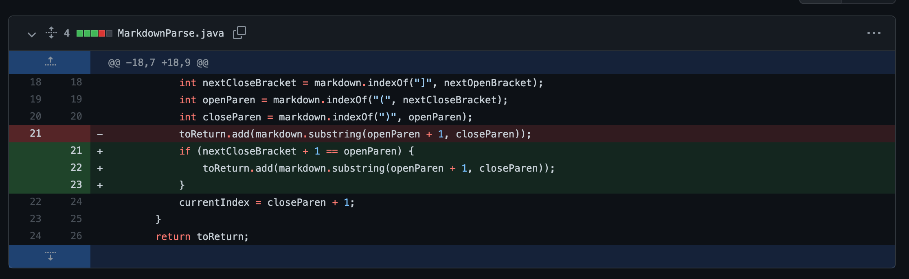
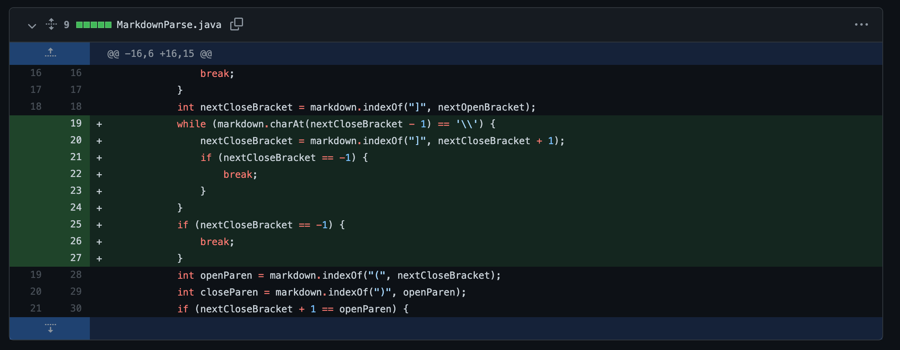
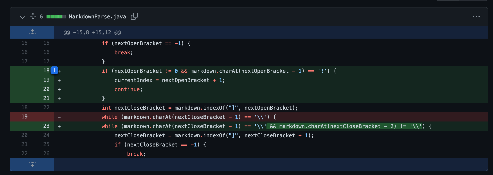

# Lab Report 2

## First Code Change: Extra Space Between Bracket and Parenthesis


- [failure-inducing input](https://github.com/melinadika/markdown-parse/blob/0f60fdd0fe1854dc43edef62e0b4174d2ca31ec0/lab4-test2.md)
```
[fake link]extra space here(not a real link)
```
- symptom:
```
$ javac markParse.java(base)
$ java markParse lab4-test2.md
[not a real link] 
// Expected []
```
- Before this fix, our code was not checking to make sure that the close bracket and open parenthesis were right next to each other (the bug). In markdown, if the close bracket is not immediately before open parenthesis, a link is not created, so `MarkdownParse` should not identify a link if there is text between ] and (, like in the test case (the failure-inducing input), but our program did (the symptom).
---

## Second Code Change: Extra (Valid) Close Bracket

- [failure-inducing input](https://github.com/melinadika/markdown-parse/blob/0f60fdd0fe1854dc43edef62e0b4174d2ca31ec0/lab4-test1.md)
```
[a \] \] \] \] text!](https://somethingelse.com)
```
- symptom:
```
$ javac markParse.java
$ java markParse lab4-test1.md
[]
// Expected [https://somethingelse.com]
```
- Our fix from the first code change created a new symptom to appear- if the link label includes escaped closed bracket, `MarkdownParse` did not identify the link, since it detected the first close bracket (from in the label), not the one that actually marked the end of the label, so it was not next to the open parenthesis (the bug). The failure-inducing input (the test case) caused this symptom to appear by including an example with multiple escaped backslashes.
---

## Third Code Change: Images

- [failure-inducing input](https://github.com/melinadika/markdown-parse/blob/880a69e1973b5d90706795a787d51beae721a837/lab4-test5.md)
```

```
- symptom:
```
$ javac markParse.java(base)
$ java markParse lab4-test5.md
[./pic.png] 
// Expected []
```
- In this case, the failure-inducing input was a test with a image istead of a link. In this case `MarkdownParse` was identifying the image path as a link, when it should not have (the symptom). This was caused by a bug in our program- it did not check whether there was an exclamation mark before the open bracket, so it did not differentiate between a link and an image.