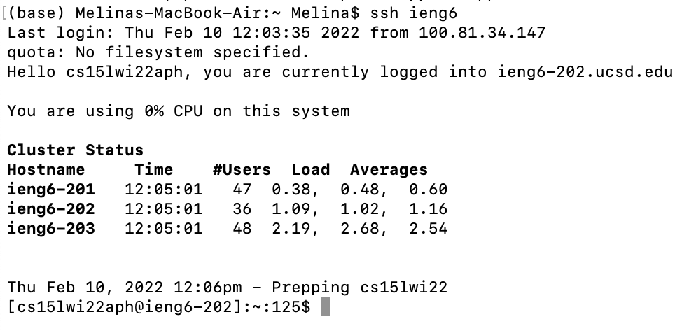
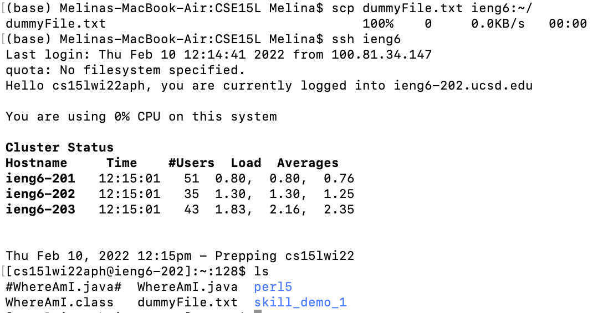

# Lab Report 3

## Streamlining `ssh` Configuration
- In order to streamline connecting through `shh` I had to first create an alias in my local `.ssh/config` file. I opened up the file in vscode via my terminal using `code .ssh/config`, copied in Joe's example, and set my username.
- My `.ssh/config` file:
```
Host ieng6
    HostName ieng6.ucsd.edu
    User cs15lwi22aph
```

- After saving that file, I can now use `ieng6` in place of `cs15lwi22aph@ieng6.ucsd.edu` at the command line.
- Connecting using this alias:

- I can also use the `ieng6` alias when sending files to the server useing `scp`. This whole process greatly simplifies connecting and sending files; instead of having to type out (and remember) `cs15lwi22aph@ieng6.ucsd.edu`, I can just use `ieng6` instead.
- Using `scp`:

