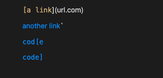
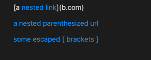
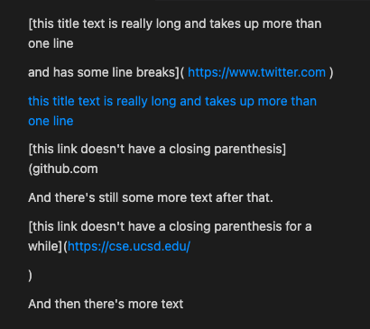

# Lab Report 4

## Code Snippet 1
```
`[a link`](url.com)

[another link](`google.com)`

[`cod[e`](google.com)

[`code]`](ucsd.edu)
```
- VSCode preview for this snippet:

    
- Based on this preview, we can expect `getLinks` to output a List containing": ```"`google.com", "google.com", "ucsd.edu"```
- I turned this snippet into a test by adding it to a new test file named `snippet-1.md` and adding the following test (and helper method if necessary) to `markdownParseTest.java` in both my group's repository, and the repository we reviewed:
    ```
    @Test
    public void testSnippet1() throws IOException {
        assertLinks(List.of("`google.com", "google.com", "ucsd.edu"), "testCases/snippet-1.md");
    }

    public static void assertLinks(List<String> expectedLinks, String fileName) throws IOException {
        Path filePath = Path.of(fileName);
        String contents = Files.readString(filePath);
        ArrayList<String> links = MarkdownParse.getLinks(contents);

        assertEquals(expectedLinks, links);
    }
    ```
- ### [My Implementation](https://github.com/ocboogie/markdown-parse)
    - The test did not pass
    - Output:
        ```
        1) testSnippet1(MarkdownParseTest)
        java.lang.AssertionError: expected:<[`google.com, google.com, ucsd.edu]> but was:<[url.com, `google.com, google.com]>
            at org.junit.Assert.fail(Assert.java:89)
            at org.junit.Assert.failNotEquals(Assert.java:835)
            at org.junit.Assert.assertEquals(Assert.java:120)
            at org.junit.Assert.assertEquals(Assert.java:146)
            at MarkdownParseTest.assertLinks(MarkdownParseTest.java:111)
            at MarkdownParseTest.testSnippet1(MarkdownParseTest.java:93)
        ```
    - I think that a simple change that would make this example work with my group's code would be to also look for backticks in the file. If two backtick is found, all code between them should be ignored, when looking for parenthesis and brackets.
- ### [Implementation I Reviewed](https://github.com/kyledvu/markdown-parse)
    - The test did not pass
    - Output:
        ```
        1) testSnippet1(MarkdownParseTest)
        java.lang.AssertionError: expected:<[`google.com, google.com, ucsd.edu]> but was:<[url.com, `google.com, google.com]>
            at org.junit.Assert.fail(Assert.java:89)
            at org.junit.Assert.failNotEquals(Assert.java:835)
            at org.junit.Assert.assertEquals(Assert.java:120)
            at org.junit.Assert.assertEquals(Assert.java:146)
            at MarkdownParseTest.assertLinks(MarkdownParseTest.java:111)
            at MarkdownParseTest.testSnippet1(MarkdownParseTest.java:93)
        ```

---

## Code Snippet 2
```
[a [nested link](a.com)](b.com)

[a nested parenthesized url](a.com(()))

[some escaped \[ brackets \]](example.com)
```
- VSCode preview for this snippet:


    
- Based on this preview, we can expect `getLinks` to output a List containing": ```a.com", "a.com(())", "example.com"```
- I turned this snippet into a test by adding it to a new test file named `snippet-2.md` and adding the following test (and helper method if necessary) to `markdownParseTest.java` in both my group's repository, and the repository we reviewed:
    ```
    @Test
    public void testSnippet2() throws IOException {
        assertLinks(List.of("a.com", "a.com(())", "example.com"), "testCases/snippet-2.md");
    }

    public static void assertLinks(List<String> expectedLinks, String fileName) throws IOException {
        Path filePath = Path.of(fileName);
        String contents = Files.readString(filePath);
        ArrayList<String> links = MarkdownParse.getLinks(contents);

        assertEquals(expectedLinks, links);
    }
    ```
- ### [My Implementation](https://github.com/ocboogie/markdown-parse)
    - The test did not pass
    - Output:
        ```
        2) testSnippet2(MarkdownParseTest)
        java.lang.AssertionError: expected:<[a.com, a.com(()), example.com]> but was:<[a.com, a.com((, example.com]>
            at org.junit.Assert.fail(Assert.java:89)
            at org.junit.Assert.failNotEquals(Assert.java:835)
            at org.junit.Assert.assertEquals(Assert.java:120)
            at org.junit.Assert.assertEquals(Assert.java:146)
            at MarkdownParseTest.assertLinks(MarkdownParseTest.java:111)
            at MarkdownParseTest.testSnippet2(MarkdownParseTest.java:98)
        ```
    - I think that a fixing this test would require a larger change. We would need to add a findCloseParen and method similar to the one Joe did in class. We would also need a similar method for brackets, which find the most inside pair of brackets to use.
- ### [Implementation I Reviewed](https://github.com/kyledvu/markdown-parse)
    - The test did not pass
    - The test did not pass
    - Output:
        ```
        2) testSnippet2(MarkdownParseTest)
        java.lang.AssertionError: expected:<[a.com, a.com(()), example.com]> but was:<[a.com, a.com((, example.com]>
            at org.junit.Assert.fail(Assert.java:89)
            at org.junit.Assert.failNotEquals(Assert.java:835)
            at org.junit.Assert.assertEquals(Assert.java:120)
            at org.junit.Assert.assertEquals(Assert.java:146)
            at MarkdownParseTest.assertLinks(MarkdownParseTest.java:111)
            at MarkdownParseTest.testSnippet2(MarkdownParseTest.java:98)
        ```

---

## Code Snippet 3
```
[this title text is really long and takes up more than 
one line

and has some line breaks](
    https://www.twitter.com
)

[this title text is really long and takes up more than 
one line](
    https://ucsd-cse15l-w22.github.io/
)


[this link doesn't have a closing parenthesis](github.com

And there's still some more text after that.

[this link doesn't have a closing parenthesis for a while](https://cse.ucsd.edu/


)

And then there's more text
```
- VSCode preview for this snippet:

    
- Based on this preview, we can expect `getLinks` to output a List containing": ```https://ucsd-cse15l-w22.github.io/```
- I turned this snippet into a test by adding it to a new test file named `snippet-3.md` and adding the following test (and helper method if necessary) to `markdownParseTest.java` in both my group's repository, and the repository we reviewed:
    ```
    @Test
    public void testNewline() throws IOException {
        assertEquals(List.of(),
                MarkdownParse.getLinks("[link](foo\nbar)"));
    }

    public static void assertLinks(List<String> expectedLinks, String fileName) throws IOException {
        Path filePath = Path.of(fileName);
        String contents = Files.readString(filePath);
        ArrayList<String> links = MarkdownParse.getLinks(contents);

        assertEquals(expectedLinks, links);
    }
    ```
- ### [My Implementation](https://github.com/ocboogie/markdown-parse)
    - The test did not pass
    - Output:
        ```
        3) testSnippet3(MarkdownParseTest)
        java.lang.AssertionError: expected:<[https://ucsd-cse15l-w22.github.io/]> but was:<[]>
            at org.junit.Assert.fail(Assert.java:89)
            at org.junit.Assert.failNotEquals(Assert.java:835)
            at org.junit.Assert.assertEquals(Assert.java:120)
            at org.junit.Assert.assertEquals(Assert.java:146)
            at MarkdownParseTest.assertLinks(MarkdownParseTest.java:111)
            at MarkdownParseTest.testSnippet3(MarkdownParseTest.java:103)
        ```
    - I think a relatively easy fix for this test would be to adjust the part of the code which considers line breaks. I would need to add the condition that if there is only one line break between the parentheses and link test, the link test should be counted.
- ### [Implementation I Reviewed](https://github.com/kyledvu/markdown-parse)
    - The test did not pass
    - Output:
        ```
        3) testSnippet3(MarkdownParseTest)
        java.lang.AssertionError: expected:<[https://ucsd-cse15l-w22.github.io/]> but was:<[]>
            at org.junit.Assert.fail(Assert.java:89)
            at org.junit.Assert.failNotEquals(Assert.java:835)
            at org.junit.Assert.assertEquals(Assert.java:120)
            at org.junit.Assert.assertEquals(Assert.java:146)
            at MarkdownParseTest.assertLinks(MarkdownParseTest.java:111)
            at MarkdownParseTest.testSnippet3(MarkdownParseTest.java:103)
        ```

---